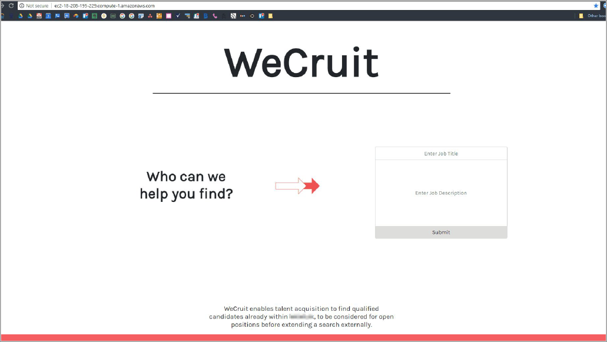
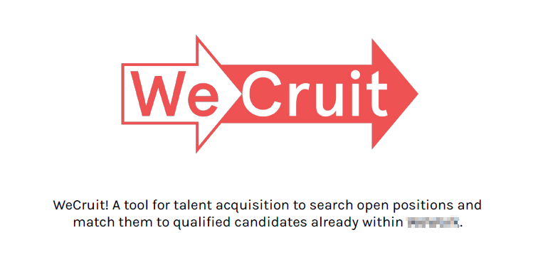

# wecruit-web-app-ui
Front-end web design of talent recruitment app for company data bootcamp using Bootstrap &amp; D3.js

*Note:  All names and proprietary information have been redacted.*

 

As part of a two-week company bootcamp, teams were asked to identify and solve a business problem by proposing a product that enables data visualization and improves access to information and insights.

 

### **Problem Statement:**

We spend ~$15.5 million in recruiting costs annually because upper level positions are sourced externally instead of by willing, talented employees already within WeWork.

### **Data Product Solution:**

WeCruit, a play on "recruit", is a web app that surfaces the top 10 internal employees who best match a job description.  The app summarizes key information such as their company tenure and current people manager, enabling Talent Acquisition to quickly vet potential candidates.  In addition to knowledge retention, each internally sourced new hire can save ~$7k in recruiting costs.

 

 

